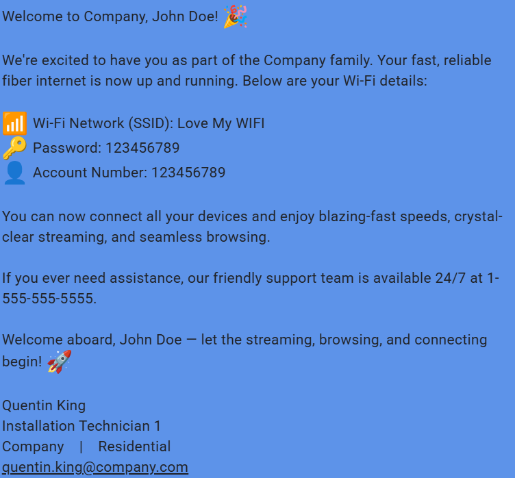

<div align="center">

# 🎉 Welcome Message Automation



[](https://python.org)
[](https://rich.readthedocs.io/)
[](https://textbee.dev)
[](LICENSE)

*A beautiful, feature-rich CLI application for automating customer welcome messages for ISPs and service providers*

[🚀 Quick Start](#-quick-start) • [📖 Documentation](#-documentation) • [🎨 Features](#-features) • [🛠️ Development](#️-development)

</div>

---

## ✨ Features

<table>
<tr>
<td width="50%">

### 🎨 **Beautiful Rich UI**

- Stunning panels and tables
- Progress indicators and status bars
- Color-coded output with emojis
- Professional terminal interface

### 🔒 **Security First**

- Masked sensitive credentials
- Secure environment variable handling
- Safe API key management
- Privacy-focused design

</td>
<td width="50%">

### 📱 **Smart Messaging**

- Jinja2 template system
- Customizable message templates
- Real-time message preview
- Multi-provider API support

### 🚀 **Developer Experience**

- Rich logging with timestamps
- Comprehensive error handling
- Clean, maintainable code
- Easy configuration management

</td>
</tr>
</table>

> **💡 Customization Note**: This tool was originally developed for ISP customer onboarding but can be easily customized for any service provider. Simply update the message templates in the `templates/` directory to match your company's branding and requirements.

---

## 🏗️ Project Architecture

```
📦 welcome-message-automation/
├── 🎯 src/                           # Core application code
│   ├── 🚀 main.py                    # Enhanced Rich UI application
│   ├── 🌐 api/
│   │   └── 📡 textbee_client.py      # TextBee API integration
│   ├── 👥 models/
│   │   └── 🏠 customer.py            # Customer data models
│   └── 🛠️ utils/
│       ├── ⚙️ config.py              # Configuration management
│       └── 🎨 render.py              # Jinja2 template rendering
├── 📄 templates/                     # Message templates
│   ├── 💌 welcome_message.txt        # Company-specific template
│   └── 🧾 welcome_message_sanitized.txt
├── 🖼️ assets/images/logos/           # Brand assets
├── 📋 requirements.txt               # Python dependencies
└── 🔐 .env                          # Environment variables
```

---

## 🚀 Quick Start

<details>
<summary><strong>📥 Installation Guide</strong></summary>

### 1️⃣ Clone the Repository

```bash
git clone https://github.com/H2OKing89/welcome-message-automation.git
cd welcome-message-automation
```

### 2️⃣ Set Up Python Environment

```bash
# Create virtual environment
python -m venv .venv

# Activate environment
# Windows:
.venv\Scripts\activate
# macOS/Linux:
source .venv/bin/activate
```

### 3️⃣ Install Dependencies

```bash
pip install -r requirements.txt
```

### 4️⃣ Configure Environment

Create `.env` file with your TextBee credentials:

```env
TEXTBEE_API=your_api_key_here
TEXTBEE_DEVICE_ID=your_device_id_here
```

</details>

---

## 🎮 Usage

### Launch the Application

```bash
python src/main.py
```

The application features a beautiful Rich-powered interface with tables, panels, and real-time feedback for an enhanced user experience.

### 🔄 Application Flow

| Step | Description |
|------|-------------|
| **📝 Input** | Enter customer details with guided prompts and emojis |
| **👀 Preview** | Review formatted message in beautiful bordered panel |
| **🚀 Send** | Send via TextBee API with progress tracking and status updates |
| **✅ Confirm** | Get detailed delivery confirmation with batch ID and recipient count |

### 📱 Sample Output

Here's what customers receive on their phones:

<div align="center">

</div>

*Example of the formatted welcome message as received by customers*

---

## 🎨 Rich UI Components

### 🎭 Visual Elements

- 🎨 **Rich Panels** - Bordered content areas
- 📊 **Data Tables** - Structured information display  
- ⏳ **Progress Bars** - Real-time operation feedback
- 🌀 **Status Spinners** - Loading indicators

### 🔒 Security Features

- 🎭 **Credential Masking** - Hidden passwords
- 🔐 **Partial SSID Display** - First 4 chars + ****
- 📝 **Rich Logging** - Timestamped events
- 🛡️ **Safe Error Handling** - No data leaks

---

## 📖 Documentation

### 🎨 Template System

<details>
<summary><strong>🔧 Template Configuration</strong></summary>

#### Available Variables

```jinja2
{{ customer_name }}      # Customer's full name
{{ account_number }}     # Account identifier
{{ ssid }}              # Wi-Fi network name
{{ password }}          # Wi-Fi password
{{ company_name }}      # Your company name
{{ support_phone }}     # Support contact
{{ service_type }}      # Service category
{{ technician_name }}   # Tech name
{{ technician_title }}  # Tech position
{{ technician_email }}  # Tech email
```

#### Template Example

```html
<div style="background: #f8f9fa; padding: 15px; border-left: 4px solid #007bff; border-radius: 5px;">
Welcome to {{ company_name }}, {{ customer_name }}! 🎉

Your {{ service_type }} internet is ready!

📶 Network: {{ ssid }}
🔑 Password: {{ password }}
📞 Support: {{ support_phone }}

{{ technician_name }}
{{ technician_title }}
</div>
```

</details>

### 🔧 Dependencies

<div align="center">

| Package | Version | Purpose |
|---------|---------|---------|
|  | Latest | Beautiful terminal UI |
|  | Latest | Modern HTTP client |
|  | Latest | Template engine |
|  | Latest | Environment management |

</div>

---

## 🛠️ Development

### 🧪 Running Tests

```bash
# Run security tests
python test_security.py

# Check code quality
pylint src/

# Format code
black src/
```

### 🔍 Debugging

The application includes comprehensive logging:

```python
# Rich logging with timestamps
[18:58:50] INFO Starting welcome message process
[19:01:05] INFO TextBee API client initialized
[19:01:07] INFO Message sent successfully via TextBee API
```

---

## 🤝 Contributing

<div align="center">

We welcome contributions! 🎉

[](https://github.com/H2OKing89/welcome-message-automation/graphs/contributors)
[](https://github.com/H2OKing89/welcome-message-automation/issues)
[](https://github.com/H2OKing89/welcome-message-automation/pulls)

</div>

### 🎯 How to Contribute

1. 🍴 Fork the repository
2. 🌿 Create a feature branch
3. 💻 Make your changes
4. ✅ Add tests if needed
5. 📝 Update documentation
6. 🚀 Submit a pull request

---

<div align="center">

## 📄 License

This project is licensed under the MIT License - see the [LICENSE](LICENSE) file for details.

---

**Made with ❤️ and ☕ by Quentin**

[](https://github.com/H2OKing89/welcome-message-automation)
[](https://python.org)
[](https://rich.readthedocs.io/)

*Transforming customer onboarding, one message at a time* ✨

</div>
